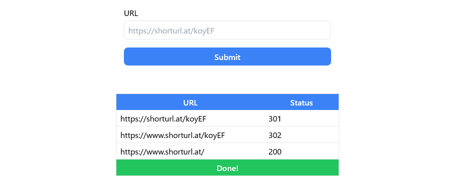

# Unshrtn - URL Unshortener

- Safely restore shortened URL  
  (URL un-shortening is handled server side)
- No-JS (No JavaScript required)



## Dev
```bash
$ npm install
$ npm run dev
$ npm run css ## and run in another terminal
```

## Build
```bash
$ npm install
$ npm run build
```

## Deploy
```bash
$ npm run build
$ npm run deploy:worker
```

## Author
[shinosaki](https://shinosaki.com)

## LICENSE
[MIT](./LICENSE)